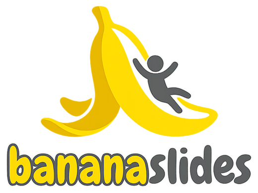

<div align="center">



<br />

[English](README.md) | 한국어 | [简体中文](README_cn.md)

</div>

# bananaslides

`bananaslides`는 슬라이드 이미지에서 편집 가능한 `.pptx`를 복원합니다.

이미지나 스크린샷처럼 시각적인 슬라이드가 이미 존재하지만, 최종 산출물에는 PowerPoint 안에서 수정 가능한 텍스트 박스가 다시 필요할 때 사용하는 도구입니다.

## 1. 무엇을 하나요?

슬라이드 이미지를 입력으로 받아 `bananaslides`는 다음 로컬 복원 파이프라인을 수행합니다.

- 텍스트 영역 감지
- 로컬 ONNX 모델 기반 OCR
- 필요 시 기대 문구 기반 OCR 보정
- 배경 이미지에서 텍스트 제거
- 편집 가능한 텍스트 박스 재구성
- 최종 `.pptx` 렌더링

다음과 같은 작업에 적합합니다.

- 생성형 이미지에서 편집 가능한 슬라이드 복원
- 래스터화된 슬라이드를 편집 가능한 PPT로 복구
- Python 또는 CLI 기반 슬라이드 이미지 -> PPT 자동화

## 2. 포함 기능

- `RapidOCR + ONNX Runtime` 기반 로컬 OCR
- `PP-OCRv5 mobile` OCR 프리셋 부트스트랩
- `OpenCV Telea` 기반 텍스트 마스크/인페인팅
- 문단 재구성과 제목/본문 분리
- 슬라이드/덱 단위 폰트 크기 정규화
- `python-pptx` 기반 편집 가능한 PowerPoint 렌더링
- 단계별 결과물 또는 원샷 파이프라인용 CLI

## 3. 설치

### 3.1 소스에서 설치

```bash
git clone <your-repo-url> bananaslides
cd bananaslides
pip install -e .
```

### 3.2 빌드된 wheel 설치

```bash
python -m build --wheel
pip install dist/bananaslides-0.1.0-py3-none-any.whl
```

### 3.3 개발용 설치

```bash
pip install -e ".[dev]"
```

### 3.4 웹 백엔드 설치

```bash
pip install -e ".[dev,web]"
```

## 4. 처음 한 번 필요한 설정

OCR 모델은 로컬 캐시에 설치됩니다. 첫 OCR 작업 전에 한 번 실행하세요.

```bash
bananaslides init-models --preset ko-en
```

확인용 명령:

```bash
bananaslides list-ocr-presets
bananaslides show-config
```

기본 OCR 모델 캐시 위치:

- macOS: `~/Library/Caches/bananaslides/ocr_models`
- Linux: `~/.cache/bananaslides/ocr_models`
- Windows: `%LOCALAPPDATA%\\bananaslides\\ocr_models`

## 5. 빠른 시작

### 5.1 래스터 슬라이드 이미지 1장을 원샷 처리

```bash
bananaslides run slide.png --output-dir artifacts/slide
```

`run`은 의도적으로 이미지 전용입니다. 입력이 PDF라면 `deck` 명령을 사용하세요.

### 5.2 여러 이미지 또는 PDF에서 다중 슬라이드 PPTX 생성

```bash
bananaslides deck slide1.png slide2.png slide3.png --output-dir artifacts/deck
```

```bash
bananaslides deck slides.pdf --output-dir artifacts/deck
```

일반적인 출력:

```text
artifacts/deck/
  slide-01/
    slide1.detections.json
    slide1.ocr.json
    slide1.mask.png
    slide1.background.png
    slide1.pptx
  slide-02/
    slide2.detections.json
    slide2.ocr.json
    slide2.mask.png
    slide2.background.png
    slide2.pptx
  slide-03/
    slide3.detections.json
    slide3.ocr.json
    slide3.mask.png
    slide3.background.png
    slide3.pptx
  deck.pptx
```

슬라이드 순서는 입력 인자 순서를 따릅니다. PDF는 페이지 순서가 슬라이드 순서가 됩니다. 첫 번째 슬라이드 이미지 또는 첫 번째 PDF 페이지 크기가 전체 덱 슬라이드 크기가 됩니다.

단일 슬라이드 출력:

```text
artifacts/slide/
  slide.detections.json
  slide.ocr.json
  slide.mask.png
  slide.background.png
  slide.pptx
```

### 5.3 단계별 파이프라인 실행

```bash
bananaslides detect-text slide.png
bananaslides ocr-text slide.png artifacts/slide/slide.detections.json
bananaslides inpaint-text slide.png artifacts/slide/slide.detections.json
bananaslides render-from-artifacts \
  slide.png \
  artifacts/slide/slide.detections.json \
  artifacts/slide/slide.ocr.json \
  artifacts/slide/slide.background.png
```

### 5.4 기대 문구로 OCR 보정

```bash
bananaslides repair-ocr \
  artifacts/slide/slide.ocr.json \
  --expected-text "Revenue grew 18%" \
  --expected-text "Gross margin improved"
```

## 6. 명령줄 인터페이스

주요 명령:

- `bananaslides show-config`
- `bananaslides list-ocr-presets`
- `bananaslides init-models`
- `bananaslides use-ocr-preset`
- `bananaslides detect-text`
- `bananaslides ocr-text`
- `bananaslides inpaint-text`
- `bananaslides deck`
- `bananaslides repair-ocr`
- `bananaslides render-from-artifacts`
- `bananaslides run`

입력 규칙:

- `bananaslides run`: 래스터 슬라이드 이미지 1장
- `bananaslides deck`: 하나 이상의 래스터 슬라이드 이미지, PDF 1개, 또는 이미지/PDF 혼합 입력

도움말:

```bash
bananaslides --help
bananaslides run --help
```

자세한 명령 예시는 [docs/cli.md](docs/cli.md)에서 볼 수 있습니다.

### 6.1 웹 앱

이 저장소는 웹 제품도 함께 포함합니다.

- `Auto Mode`: 업로드 -> 처리 -> 다운로드
- `Review Mode`: 업로드 -> OCR 검토 -> 수동 검토 후 PPTX 생성

웹 API 실행:

```bash
bananaslides-web-api
```

프론트 실행:

```bash
cd web
npm install
npm run dev
```

기본 API 주소는 `http://127.0.0.1:8000`입니다. 필요하면 `VITE_API_BASE_URL`로 변경하세요.

기본 웹 job store 루트는 `./bananaslides-web-data`입니다.

현재 웹 UI는 슬라이드를 이동할 때 검토 편집 내용을 자동 저장하고, `Build PPTX`에서 최종 슬라이드 재생성과 PPTX 조립을 수행합니다.

## 7. 문서

- 설치 및 환경: [docs/installation.md](docs/installation.md)
- CLI 사용법: [docs/cli.md](docs/cli.md)
- 웹 앱/API 사용법: [docs/web.md](docs/web.md)
- 파이프라인 아키텍처: [docs/architecture.md](docs/architecture.md)
- 현재 한계: [docs/limitations.md](docs/limitations.md)

## 8. 기술 요약

기본 파이프라인:

1. 전체 슬라이드 텍스트 감지
2. 로컬 ONNX 자산 기반 RapidOCR 수행
3. 기대 텍스트 후보 기반 OCR 보정
4. 텍스트 마스크 생성
5. OpenCV Telea 기반 배경 복원
6. OCR 라인을 문단 배치로 재구성
7. 제목/본문 분리 및 폰트 크기 정규화
8. `python-pptx` 기반 편집 가능한 `.pptx` 렌더링

아키텍처 상세는 [docs/architecture.md](docs/architecture.md)를 참고하세요.

## 9. 플랫폼 메모

- macOS, Linux, Windows의 OCR 캐시/폰트 경로 처리가 구현되어 있습니다.
- 기본 런타임은 CPU 기반 `onnxruntime`입니다.
- 번들 폰트가 없을 때는 시스템 폰트를 fallback으로 사용합니다.
- macOS에서는 fresh install과 CLI smoke test를 확인했습니다.
- Linux와 Windows는 코드 경로는 구현되어 있지만, 실제 릴리스 전 별도 검증이 필요합니다.

## 10. 한계

- 수식은 PowerPoint native equation object로 변환되지 않습니다.
- 차트, 아이콘, 장식 그래픽은 대체로 배경 이미지에 남습니다.
- OCR 품질은 텍스트 선명도, 간격, 이미지 품질에 영향을 받습니다.
- 매우 조밀한 레이아웃이나 복잡한 표는 수동 검토가 필요할 수 있습니다.

자세한 내용은 [docs/limitations.md](docs/limitations.md)를 참고하세요.

## 11. 개발

테스트 실행:

```bash
python -m pytest
```

wheel 빌드:

```bash
python -m build --wheel
```

프로젝트 구조:

```text
api/
web/
src/bananaslides/
src/bananaslides_webapi/
tests/
docs/
pyproject.toml
README.md
README_ko.md
README_cn.md
```

## 라이선스

Apache-2.0. 자세한 내용은 [LICENSE](LICENSE)를 참고하세요.
